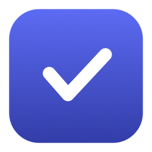

<p align="center">
  
</p>

<h1 align="center">DayBar</h1>

<p align="center">
  A native macOS <strong>menu-bar app to plan your day, focus with a Pomodoro, and actually finish
  what you planned</strong> — with unfinished tasks carried into tomorrow under a <em>gentle</em>, escalating
  nudge instead of silently disappearing.
</p>

<p align="center">
  
  
  
  
</p>

<p align="center">
  Lives in your menu bar — no Dock icon. Plan in the morning, work through the day, and run a
  quick end-of-day review before you sleep.
</p>

## Features

- **Daily habits** — recurring rituals (e.g. after morning coffee) on a schedule (every day, weekdays,
  weekends, or custom days); one-tap check-off, streak tracking with a gentle grace day, optional anchor
  reminders, and optional sync to Apple Reminders as recurring reminders.
- **Daily todos** — capture today's plan; check off, delay, reschedule, or drop. Quick-add for **today
  or tomorrow** with a segmented picker.
- **Gentle carry-over** — unfinished tasks roll to the next day and age (grey → amber pill +
  a quiet menu-bar count). Calm by default, never a wall of red.
- **Pomodoro** — customizable focus/break durations, cycles, auto-start; a **live mm:ss
  countdown right in the menu bar**; accurate across sleep/wake (wall-clock based). Optionally
  **skip a break** if you've stepped away long enough (assumes you already rested).
- **Focus garden** — a small farming game you **pop out into its own resizable window** and walk
  around (click-to-move, powered by SpriteKit): a larger top-down farm with crop beds, a river crossed
  by a bridge, a cottage, a barn, a companion, and **farm animals** (chickens, cows, sheep) you buy and
  that give eggs, milk and wool. Everything is still fueled **only by completed focus sessions** — walk
  up to a ripe plot or a ready animal to collect. A coins/streak/ready HUD, a recent-reward feed, an
  accessible Actions menu, and a shop round it out. Harvest/plant automatically, or switch to **Manual**
  mode in Settings. Soft wilt on misses, one grace day, shop unlocks. Sprites are original DayBar pixel
  art (CC0, AI-assisted; see `ThirdParty/NOTICE-garden.md`), 32px tiles rendered with nearest-neighbor
  scaling. The same sprite sheet drives the app and the landing site so they can't drift.
  Replaces the old Dayscape ink strip; streak milestones at 7 / 30 / 100 remain. Showcased on the
  [product site](https://underworld14.github.io/daybar/).
- **Lofi Radio** — built-in **SomaFM** ambient/lofi stations in the panel footer; tap ▶ to start
  (random station) or pick from a simple list; skip stations, now-playing label, offline channel cache;
  menu-bar waveform while playing; **auto-pauses when a focus session ends**.
- **Task history** — browse completed tasks grouped by day (last 30 days).
- **Analytics (Swift Charts)** — tasks and habits tabs; daily / weekly / monthly trends,
  habit consistency heatmap (28 days), streak leaderboard, focus minutes, and Pomodoro sessions.
- **Notifications** — morning planning + evening review reminders, a phase-end alert (shows
  even when the panel is closed), and a once-daily nudge when tasks pile up.
- **End-of-day review** — "Did you finish what you planned?" — triage what's left and jot a
  one-line reflection; optional mood tagging with analytics.
- **On-device AI mood suggestions** — when Apple Intelligence is available (macOS 26+), DayBar
  uses Apple's **[Foundation Models](https://developer.apple.com/documentation/foundationmodels)**
  (`SystemLanguageModel`) to suggest a mood tag from your reflection. Classification runs
  entirely on-device — no cloud LLM, no account, no data leaves the Mac. Falls back to a
  manual picker when the model is unavailable or you turn the feature off.
- **Quick-add hotkey** — a global shortcut (default ⌥⌘D) opens the panel focused on the field.
- **Apple Reminders sync** — optional two-way sync with selected Reminder lists (complete,
  delay, and reschedule flow back to Reminders). Habits can sync as recurring reminders on their schedule.
- **Backup & restore** — export/import a local JSON snapshot of tasks (including notes & checklists), habits, and focus
  sessions from Settings.
- **Calm controls** — undo for drop/archive/stop, Away mode, quiet hours, optional weekly digest,
  and nudge intensity (Gentle / Standard).
- **Local & private** — stored on-device with SwiftData; no account, no cloud. Radio metadata and
  artwork are cached locally; streams come from [SomaFM](https://somafm.com). AI mood uses
  on-device Foundation Models only when enabled.

## Download

Product page: **[underworld14.github.io/daybar](https://underworld14.github.io/daybar/)**.

Pre-built releases for macOS 14+ are on **[GitHub Releases](https://github.com/underworld14/daybar/releases)**.

### Install

1. Download the latest `DayBar-vX.Y.Z-macOS.zip` from [Releases](https://github.com/underworld14/daybar/releases).
2. Double-click the zip to extract `DayBar.app`.
3. Drag **DayBar.app** into **Applications**.
4. Open DayBar from Applications. The icon appears in the **menu bar** (there is no Dock icon).

### First launch & Gatekeeper

Release builds are ad-hoc signed. macOS may block the first open with *"DayBar can't be opened
because Apple cannot check it for malicious software."* Use either method:

**Option A — Right-click (easiest)**

1. In Finder, **right-click** (or Control-click) `DayBar.app` in Applications.
2. Choose **Open**.
3. Click **Open** in the dialog. You only need to do this once.

**Option B — Terminal (`xattr`)**

Removes the quarantine flag macOS adds to downloaded files:

```sh
xattr -cr /Applications/DayBar.app
open /Applications/DayBar.app
```

> **Notifications & launch at login:** For reliable permission prompts, build from source once in
> Xcode with your Apple ID team, or wait for a future Developer ID–signed release.

### Automatic updates

DayBar checks **[GitHub Releases](https://github.com/underworld14/daybar/releases)** daily via
[Sparkle](https://sparkle-project.org). When a newer version is available, you'll see a standard
**Install & Relaunch** prompt — nothing installs without your approval.

- **Manual check:** Settings → **Check for Updates…**
- **Feed:** `https://underworld14.github.io/daybar/appcast.xml`

Ad-hoc signed builds still require the one-time Gatekeeper approval above on **first install**.
Sparkle clears quarantine on downloaded updates where macOS allows it, but cannot fully bypass
Gatekeeper for unsigned apps.

## Requirements

- macOS 14+ (developed on macOS 26 Tahoe)
- Xcode 26+
- [XcodeGen](https://github.com/yonaskolb/XcodeGen): `brew install xcodegen`
- **Optional — AI mood suggestions:** macOS 26+ with Apple Intelligence enabled (uses the
  on-device [Foundation Models](https://developer.apple.com/documentation/foundationmodels)
  framework). The rest of DayBar works without it.

## Build & run

The Xcode project is generated from `project.yml` (it isn't committed):

```sh
xcodegen generate
open DayBar.xcodeproj      # Run the "DayBar" scheme
# or, from the CLI:
xcodebuild -project DayBar.xcodeproj -scheme DayBar -destination 'platform=macOS' build
```

DayBar is an *accessory* app — look for its icon in the **menu bar**, not the Dock.

> For notifications and launch-at-login, run once from Xcode with automatic signing (a free
> Apple ID) so macOS grants permission — the default ad-hoc signing is unreliable for those.

## Test

```sh
xcodebuild -project DayBar.xcodeproj -scheme DayBar -destination 'platform=macOS' test
```


### GitHub Pages (product site)

The landing page lives in [`site/`](site/) and deploys via [`.github/workflows/pages.yml`](.github/workflows/pages.yml)
to the `gh-pages` branch on every push to `main` that touches `site/**`.

**One-time repo setting:** GitHub → **Settings** → **Pages** → **Build and deployment** → Source:
**Deploy from a branch** → branch `gh-pages` / `/ (root)`.

After deploy, verify:
- [https://underworld14.github.io/daybar/](https://underworld14.github.io/daybar/)
- [https://underworld14.github.io/daybar/appcast.xml](https://underworld14.github.io/daybar/appcast.xml)

## Publishing a release

Maintainers only. Releases are published to
**[GitHub Releases](https://github.com/underworld14/daybar/releases)** as `DayBar-vX.Y.Z-macOS.zip`.


### 0. One-time Sparkle signing setup

The Release workflow signs update archives with an EdDSA key. Generate keys once (Sparkle 2.6.4):

```sh
curl -fsSL -o /tmp/Sparkle.tar.xz \
  "https://github.com/sparkle-project/Sparkle/releases/download/2.6.4/Sparkle-2.6.4.tar.xz"
tar -xf /tmp/Sparkle.tar.xz -C /tmp
/tmp/bin/generate_keys          # stores private key in Keychain; prints SUPublicEDKey for Info.plist
/tmp/bin/generate_keys -x sparkle-private-key.txt  # add file contents to GitHub secret SPARKLE_EDDSA_PRIVATE_KEY
```

The public key in [`DayBar/Info.plist`](DayBar/Info.plist) must match the private key in the secret.
After each tagged release, CI updates [`site/appcast.xml`](site/appcast.xml) and deploys it to GitHub Pages.

You need the [GitHub CLI](https://cli.github.com/) (`brew install gh`) logged in (`gh auth login`).

### 1. Bump the version

Edit [`project.yml`](project.yml):

```yaml
MARKETING_VERSION: "0.3.0"   # user-facing semver → tag v0.3.0
CURRENT_PROJECT_VERSION: "2" # optional build number bump
```

Commit and push to `main`:

```sh
git add project.yml
git commit -m "chore: bump version to 0.3.0"
git push origin main
```

### 2. Publish (pick one)

#### Option A — Automatic via GitHub Actions (recommended)

Push a version tag. The [Release workflow](.github/workflows/release.yml) builds a Release
`.app`, zips it, and attaches it to the GitHub Release:

```sh
git tag v0.3.0
git push origin v0.3.0
```

Watch progress: **Actions** tab on GitHub, or locally:

```sh
gh run list --workflow=Release
gh run watch   # optional: follow the latest run
```

When it finishes, the release appears at `https://github.com/underworld14/daybar/releases/tag/v0.3.0`.

To edit release notes after CI creates the draft assets:

```sh
gh release edit v0.3.0 --notes "What's new in 0.3.0 …"
```

#### Option B — Manual build + `gh release create`

Useful if Actions is down or you want to ship from your Mac directly:

```sh
xcodegen generate

xcodebuild -project DayBar.xcodeproj -scheme DayBar \
  -configuration Release \
  -destination 'platform=macOS' \
  -derivedDataPath build/DerivedData \
  build

cd build/DerivedData/Build/Products/Release
ditto -c -k --sequesterRsrc --keepParent DayBar.app DayBar-v0.3.0-macOS.zip

gh release create v0.3.0 DayBar-v0.3.0-macOS.zip \
  --title "DayBar 0.3.0" \
  --notes "What's new in 0.3.0 …"
```

`gh release create` creates the tag on GitHub if it doesn't exist yet (no need for a separate
`git tag` + push unless you want the tag locally too).

### Checklist

- [ ] Tests pass (`xcodebuild … test`)
- [ ] `MARKETING_VERSION` in `project.yml` matches the tag (`v0.3.0` → `0.3.0`)
- [ ] Release notes mention breaking changes / Gatekeeper (`xattr`) if needed
- [ ] Download the zip from Releases and smoke-test on a clean Mac (install → menu bar icon → play radio)

## Architecture

| Target | What |
|---|---|
| `DayBarCore` | Models (`@Model`), `DataStore` (SwiftData), `RolloverEngine`, `EscalationModel`, `PomodoroEngine`, `SomaFMService` / `RadioPlayerManager`, `Analytics`, `NotificationScheduler`, on-device mood AI (`FoundationModels` / `MoodClassifier`), `AppState`. UI-free, unit-tested. |
| `DayBar` | SwiftUI + AppKit menu-bar UI: `NSStatusItem` + borderless `NSPanel` hosting `TodayView`, plus Settings / Analytics / Review / History sheets and the inline `LofiRadioStrip`. |
| `DayBarTests` | XCTest. |

A single `@Observable @MainActor AppState` is the source of truth (read via `@Environment`).
Carry-over age is computed from each task's immutable original planned date; new-day rollover
is idempotent and survives the Mac sleeping; the Pomodoro's truth is a wall-clock `endDate`.

## Roadmap

- **P3b** — Apple Calendar read-mostly integration behind the same adapter protocol.

## Contributing

See [CONTRIBUTING.md](CONTRIBUTING.md). Issues and PRs welcome.

## License

[MIT](LICENSE) © 2026 Yusril Izza
