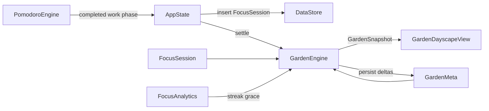

# Garden Dayscape (Phases 1–5) Implementation Plan

> **For agentic workers:** REQUIRED SUB-SKILL: Use `superpowers:subagent-driven-development` (with `superpowers:test-driven-development` per task). Do not implement until this plan is approved. Steps use checkbox (`- [ ]`) syntax in the written plan file.

**Goal:** Make focus feel like tending a small cottage garden — `DayscapeStrip` is fully replaced by a pixel-cozy plot + companion that grows from completed Pomodoros, with soft wilt, then crops/seasons/shop/polish — and the marketing site ([`site/`](site/)) becomes a living Stardew-inspired cottage scene that showcases the garden, not a flat indigo product page.

**Architecture:** Pure `GardenEngine` projects `[FocusSession]` + persisted `GardenMeta` into a `GardenSnapshot`. SwiftUI renders the snapshot (shapes first; `GardenRenderer` protocol so sprites can swap later). `FocusSession` remains the source of truth for focus; garden never double-logs sessions.

**Tech Stack:** Swift / SwiftUI / SwiftData / XCTest; XcodeGen (`project.yml`); existing `FocusAnalytics` grace/streak; backup via `StoreSnapshotDTO`.

**Execution:** Feature branch + git worktree; one implementer subagent per task; TDD (red → green → refactor); task review after each; whole-branch review after Phase 5; use `bd` for tracking (issue `daybar-xqp`).

## Locked product decisions

- Signature visual: **replace** ink strip in Today panel (and Analytics focus section)
- Hybrid: **3 plot slots + 1 companion**
- Fuel: **completed focus sessions only** (`completed == true`)
- Miss day (no grace): **soft wilt**; grace day from `FocusAnalytics` = no wilt
- Streak: keep small `Nd` pill + grace help
- Art v1 (app): **SwiftUI procedural** via `GardenRenderer` (no PNG dependency)
- Landing: **Stardew-cozy visual system** (pixel farm hero, seasonal palette, gentle CSS motion) — required Phase 5 deliverable, not optional
- End vision: Stardew-lite (crops → seasons → shop → polish + living landing), phased

## Global constraints

- Calm DayBar tone: no red guilt, no harsh death; wilt is soft fade/recover
- Menu-bar panel width stays **360**; garden row height ~48–64pt
- All new fields SwiftData-safe (defaults / optional) for lightweight migration
- Backup: `gardenMeta` optional on `StoreSnapshotDTO` (older backups preserve live garden)
- Reuse grace rules from [`FocusAnalytics`](Sources/DayBarCore/Analytics/FocusAnalytics.swift) — do not fork grace logic
- Unit-test engine in `DayBarCore`; UI mostly wiring
- Do not fuel garden from habits/todos
- Landing must stay accessible: `prefers-reduced-motion`, readable contrast, no autoplay audio
- Landing brand: keep DayBar wordmark + indigo CTA; atmosphere shifts to earth/sky/crop greens (not generic purple SaaS, not cream-serif terracotta cliché)
- Commits only when user asks (subagents: stage work; controller handles commit policy unless user enables commits)

## Data flow

## File map

| Area | Files |
|---|---|
| Model | `Sources/DayBarCore/Model/GardenMeta.swift`, `GardenTypes.swift` (slot, season, mood, crop IDs) |
| Engine | `Sources/DayBarCore/Garden/GardenEngine.swift`, `GardenCatalog.swift` |
| Persist | `DataStore.swift`, `StoreDTO.swift` (`GardenMetaDTO`) |
| State | `AppState.swift` — `gardenSnapshot`, settle on refresh / focus complete |
| UI | `GardenDayscapeView.swift`, `GardenRenderer.swift` — replace uses in `TodayView.swift`, `AnalyticsView.swift`; retire or thin-wrap `DayscapeStrip.swift` |
| Prefs | `Preferences.swift` — mute garden SFX (Phase 5) |
| Tests | `GardenEngineTests.swift`, `GardenPersistenceTests.swift` (or extend `PersistenceTests.swift`) |
| Spec/Plan | `docs/superpowers/specs/2026-07-18-garden-dayscape-design.md`, `docs/superpowers/plans/2026-07-18-garden-dayscape.md` |
| Landing | [`site/index.html`](site/index.html), [`site/styles.css`](site/styles.css), new/updated SVGs under `site/assets/screenshots/` + `site/assets/garden/` |

### Landing visual direction (locked)

- Hero is one composition: **brand + one headline + one lede + CTA + full-bleed pixel farm plane** (not a dashboard of cards)
- Farm diorama SVG/CSS layers: sky, distant hills, soil beds, 3 crops, companion, soft clouds; seasons can tint via CSS variables
- Motion (2–3 intentional): cloud drift, companion idle bob, crop sway — all gated by `prefers-reduced-motion`
- Feature section “Dayscape & focus streak” → **“Focus garden”** copy + new garden mockup SVG (replace [`dayscape-focus.svg`](site/assets/screenshots/dayscape-focus.svg))
- Update [`today-panel.svg`](site/assets/screenshots/today-panel.svg) so the panel mock shows the garden row instead of ink squares
- Typography: keep system UI for body; add one expressive display face for hero headline only (e.g. soft rounded or pixel-adjacent webfont self-hosted or system `ui-rounded`) — avoid Inter/Roboto defaults as the hero voice
- Meta description / title updated to mention growing a focus garden from Pomodoros

## Economy & growth rules (concrete)

- Coins: **+1** per completed focus session (accrue from Phase 1; spend Phase 4)
- Growth: **1 completed session = 1 stage step** on the leftmost non-mature planted slot; if none, plant default crop in first empty slot
- Stages: `0` empty → `1` seed → `2` sprout → `3` young → `4` mature
- Harvest (Phase 2+): mature + next session → clear slot, **+2 bonus coins**, companion happy pulse
- Wilt: on daily settle, if yesterday had 0 completed sessions and was not a grace day → all planted slots `wiltLevel = min(2, wiltLevel+1)`; each completed session `wiltLevel = max(0, wiltLevel-1)`
- Companion mood: `happy` if ≥1 completed today; `wilted` if any slot wilt≥1; else `idle`
- Season (calendar, NH): spring Mar–May, summer Jun–Aug, autumn Sep–Nov, winter Dec–Feb — visual from Phase 1; mechanics Phase 3
- Phase 1 crop: `parsnip` only
- Phase 2 crops: `parsnip`, `cauliflower`, `berry` (auto-cycle on new plant)
- Weather (Phase 2): `rain` if completed sessions today ≥ 2, else `clear` (visual only)
- Shop (Phase 4) catalog (fixed):
  - Seed packs 5c (unlock crop preference — cosmetic plant bias)
  - Fence decor 8c
  - Companion scarf 12c
  - Extra plot slot 20c (4th slot max)

---

## Phase 0 — Spec + plan on disk

Write approved design + this plan under `docs/superpowers/`. Open/claim `daybar-xqp`. Create feature branch `feat/garden-dayscape`.

---

## Phase 1 — Garden Dayscape foundation

**Ship:** Ink strip gone; plot+companion+streak; coins accrue; season field set; unlocks JSON empty; shop UI absent.

### Task 1.1 — Types + `GardenMeta` model (TDD)

- [ ] Add `GardenTypes` value types: `GardenSeason`, `CompanionMood`, `GardenPlotSlot`, `GardenSnapshot`
- [ ] Add `@Model GardenMeta` with defaults: `lastSettledDay`, `coins`, `lifetimeCompletedSessions`, `companionID`, `unlockedItemIDsJSON`, `currentSeasonRaw`, `plotSlotsJSON` (3 empty slots)
- [ ] Register in `DataStore` schema
- [ ] Tests: encode/decode slots JSON round-trip; default meta has 3 slots

### Task 1.2 — `GardenEngine` settle + growth (TDD)

- [ ] RED/GREEN: completed session advances stage / plants parsnip
- [ ] Incomplete session ignored
- [ ] Soft wilt + recover; grace day no wilt (call into `FocusAnalytics` helpers or shared day classification)
- [ ] Coins +1 per completed; `lifetimeCompletedSessions` increments
- [ ] Season from calendar month
- [ ] Idempotent `lastSettledDay` — same day settle twice no double wilt

### Task 1.3 — Persistence + backup (TDD)

- [ ] `GardenMetaDTO` on snapshot; import/export
- [ ] Missing key preserves live garden (mirror focusSessions pattern)
- [ ] Extend persistence tests

### Task 1.4 — AppState wiring

- [ ] Load/create `GardenMeta`; `gardenSnapshot` published
- [ ] Settle on `refresh` and after focus session insert ([`AppState` ~1051](Sources/DayBarCore/State/AppState.swift))
- [ ] Tests: AppState focus complete updates garden (pattern from existing AppState tests)

### Task 1.5 — UI replace Dayscape

- [ ] `GardenRenderer` + `GardenDayscapeView` (3 plots, companion, season tint, streak pill)
- [ ] Swap in [`TodayView`](Sources/DayBar/TodayView.swift) and [`AnalyticsView`](Sources/DayBar/AnalyticsView.swift)
- [ ] Accessibility labels for slots/companion/streak
- [ ] Remove dead `DayscapeStrip` or keep as unused-deleted in same PR

**Phase 1 done when:** panel shows garden; completing Pomodoro grows/plants; miss soft-wilts; backup round-trips; tests green.

---

## Phase 2 — Growth & crops

**Ship:** Multi-crop, harvest, light weather.

### Task 2.1 — Catalog + plant rotation (TDD)

- [ ] `GardenCatalog` crop defs (maxStage, display key)
- [ ] New plants cycle parsnip → cauliflower → berry
- [ ] Harvest at mature on next growth event

### Task 2.2 — Weather snapshot (TDD)

- [ ] `weather` on snapshot: rain if today completed ≥ 2
- [ ] Renderer rain tint / overlay dots

### Task 2.3 — UI crop differentiation

- [ ] Distinct shapes/colors per crop + stage
- [ ] Brief harvest feedback (caption or companion happy) — no modal

---

## Phase 3 — Seasons & memory

**Ship:** Season affects visuals + crop affinity; harvest log.

### Task 3.1 — Seasonal affinity (TDD)

- [ ] In-season crop grows with **2× chance to skip a stage** (or +1 bonus energy every other session — pick one in impl: **bonus +1 energy when crop season matches**)
- [ ] Off-season no penalty beyond palette

### Task 3.2 — Harvest memory (TDD)

- [ ] `harvestLogJSON` on `GardenMeta`: `{day, cropID, count}` last 30 entries
- [ ] Backup field
- [ ] Analytics: small “Harvests” line under garden (count this week)

### Task 3.3 — Seasonal renderer

- [ ] Ground/sky palette per season; companion scarf tint

---

## Phase 4 — Unlocks & shop

**Ship:** Spend coins; unlocks persist; 4th slot purchasable.

### Task 4.1 — Shop engine (TDD)

- [ ] `GardenShop` catalog + `purchase(itemID)` deducts coins / appends unlock / expands slots
- [ ] Insufficient coins no-op; idempotent unlocks

### Task 4.2 — Shop UI sheet

- [ ] Entry: tap companion or small bag affordance on garden row
- [ ] List 4 items with price + owned state
- [ ] Settings toggle not required (shop is opt-in by opening)

### Task 4.3 — Apply unlocks in renderer

- [ ] Fence decor, scarf, seed bias, 4th slot

---

## Phase 5 — App polish + living landing

**Ship:** In-app motion/SFX; landing page feels like a calm Stardew morning; README matches.

### Task 5.1 — App motion

- [ ] Companion idle bob; growth stage crossfade (~0.25s); rain particles lightweight
- [ ] `accessibilityReduceMotion` → static

### Task 5.2 — App sound

- [ ] Soft growth/harvest sounds; gate on `Preferences.soundEnabled` **and** new `gardenSoundEnabled` default true
- [ ] No sound on wilt

### Task 5.3 — Landing atmosphere + tokens

- [ ] Restyle [`site/styles.css`](site/styles.css): cottage tokens (`--soil`, `--leaf`, `--sky`, `--sun-gold`) layered under existing indigo CTA
- [ ] Body/hero background: soft sky→field gradient + subtle pixel grid or hill silhouette (not flat gray)
- [ ] Header glass over the scene; dark mode gets night-farm palette (deep indigo sky, warm window glow) without losing contrast

### Task 5.4 — Landing hero farm diorama

- [ ] Add `site/assets/garden/hero-farm.svg` (layered, animatable IDs/classes for clouds/crops/companion)
- [ ] Hero layout: brand-first, one headline (“Grow focus. Finish the day.” or equivalent), one lede mentioning Pomodoro → garden, CTA group, **full-bleed farm visual** (not a small inset card)
- [ ] Wire 2–3 CSS animations on hero layers; disable under `prefers-reduced-motion`
- [ ] Keep Download CTA indigo; do not bury the brand

### Task 5.5 — Landing feature art + copy

- [ ] Replace Dayscape feature block with **Focus garden** copy (plot + companion, soft wilt, streak grace)
- [ ] New `garden-dayscape.svg` mock (panel strip with plots/companion/streak); retire ink-strip story in [`dayscape-focus.svg`](site/assets/screenshots/dayscape-focus.svg) (replace file or point `index.html` at the new asset)
- [ ] Update [`today-panel.svg`](site/assets/screenshots/today-panel.svg) garden row to match app
- [ ] Meta description + `og`-ready title/description text in [`site/index.html`](site/index.html)

### Task 5.6 — Docs + issue close

- [ ] README feature bullet for Focus garden + note that the site showcases it
- [ ] Close `daybar-xqp` with phase notes; file follow-ups only if needed

**Phase 5 done when:** app is juicy-but-calm; opening `site/index.html` reads as one cottage composition with animated farm hero; features/docs match shipped garden.

---

## Testing strategy (every task)

1. Write failing XCTest for engine/persistence behavior
2. Confirm failure reason is missing feature
3. Minimal production code
4. Confirm green + full `DayBarTests` still pass (`xcodebuild test` or project’s usual command)
5. Task reviewer: spec compliance + quality

## Out of scope (explicit)

- Habit/todo fuel, cloud sync, multiplayer, real SpriteKit, full Stardew combat/fishing, iOS
- Replacing Pomodoro engine or Lofi Radio
- Heavy achievement spam / leaderboards
- Landing: WebGL/Three.js, autoplaying music, real Stardew IP assets, or a separate marketing CMS

## Risk notes

- Panel height: keep garden compact; details in shop sheet / analytics
- Wilt vs grace: single shared day classification to avoid streak/garden disagreement
- Shop economy: prices above are v1 constants; tune only with tests updated
- Landing vs brand: atmosphere can go cottage; CTAs and wordmark stay recognizably DayBar (indigo accent)
- Landing SVG weight: keep hero SVG under ~150KB; prefer CSS motion over giant animated GIFs
